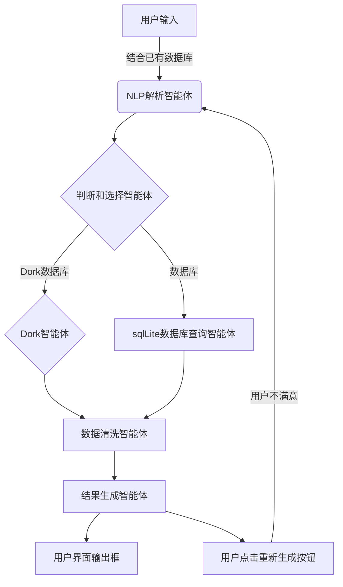
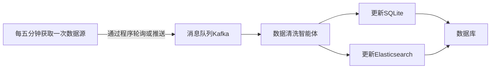

## **一、项目架构**

### 用户服务智能体

### 实时更新智能体（单智能体）

---

## **二、模块拆分与开发任务**

### **1. 网站搭建（网页组）**

#### **a. 前端**

- **技术栈**：
  - **框架**：Next.js + React
- **任务**：
  1. 设计搜索页面：
     - 搜索框（支持自然语言输入）。
     - 结果展示区（表格、卡片或列表形式）。
  2. 开发多页面路由：
     - 首页（搜索功能）。
     - 关于页面（项目介绍）。
     - 数据源页面（展示支持的数据库和API列表）。
  3. 实现数据动态渲染：
     - 从后端获取数据并渲染到页面。
     - 支持分页、排序、筛选等功能。

  4. 参考上述任务完成以下网站
     - 电车经销商网站，主页包含（内容为产品-不可点击， 销量页-伪数字-不可点击，电车情况页-数据页-导入10个车型及其数据 ）
     - 环保呼吁网站，主页包含（空气污染度-数据页， 全球变暖宣传页面-不可点击，新闻-绿化呼吁宣传新闻页面-不可点击）
     - 实时天气网站
     - 有主页和一个放数据的表即可（MVP）
#### **b. 后端**

- **技术栈**：
  - **框架**：FastAPI
  - **数据库**：SQLite（开发阶段），可扩展至PostgreSQL/MySQL。
  - **异步支持**：`async/await`。
- **任务**：
  1. 设计API接口：
     - `/search`：接收搜索请求，返回结果。
     - `/data-sources`：返回支持的数据库和API列表。
  2. 实现数据源路由：
     - 根据AI判断，调用第三方API或读取本地数据库。
  3. 数据库管理：
     - 设计表结构（如`websites`表存储URL、数据库名等）。
     - 使用SQLAlchemy或Tortoise ORM进行数据库操作。
     - 数据过大时使用redis

#### **c. 数据库**

- **技术栈**：
  - **开发阶段**：SQLite（轻量级，适合快速迭代）。
  - **生产环境**：PostgreSQL（支持高并发、复杂查询）。
- **任务**：
  1. 设计表结构：
     - `websites`表：存储URL、数据库名、是否被屏蔽等信息。
     - `api_endpoints`表：存储第三方API的URL、认证信息等。
     - 搜索素材表：存放数据。
  2. 初始化数据：
     - 开发阶段使用CSV文件导入数据。
     - 编写脚本将CSV数据批量插入数据库。

## 2. MoFA智能体

## 3. 搜索引擎主界面

## **三、开发流程**

1. **需求分析与设计**：
   - 确定功能范围（如搜索、数据源管理）。
   - 设计数据库表结构和API接口。
2. **前端开发**：
   - 实现页面布局与交互。
   - 对接后端API。
3. **后端开发**：
   - 实现API接口。
   - 完成数据库操作逻辑。
4. **多智能体开发**：
   - 训练数据源判断模型。
   - 实现数据清洗与结果生成。
5. **部署**：
   - 容器化部署（Docker）。
   - linux上的环境安装
