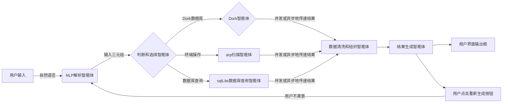
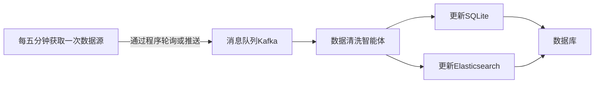

## **一、项目架构**

### 用户服务智能体

```mermaid
graph LR 
    A[用户输入] --> |自然语言| B(NLP解析智能体)
    B --> |输入三元组| C{判断和选择智能体}
    C-->|Dork数据库| D{Dork智能体}
    C -->|数据库查询| Z[sqlLite数据库查询智能体]
    C --> |终端操作| E[arp扫描智能体]
    D & E & Z--> |并发或异步地传递结果| F[数据清洗和组织智能体]
    F --> G[结果生成智能体]
    G --> H[用户界面输出框]
    G --> J[用户点击重新生成按钮] --> |用户不满意| B
```

### 实时更新智能体（单智能体）

```mermaid
graph LR
    A[每五分钟获取一次数据源] -->|通过程序轮询或推送| B[消息队列Kafka]
    B --> C[数据清洗智能体]
    C --> D[更新SQLite]
    C --> E[更新Elasticsearch]
    D --> G
    E --> G[数据库]
```

---

