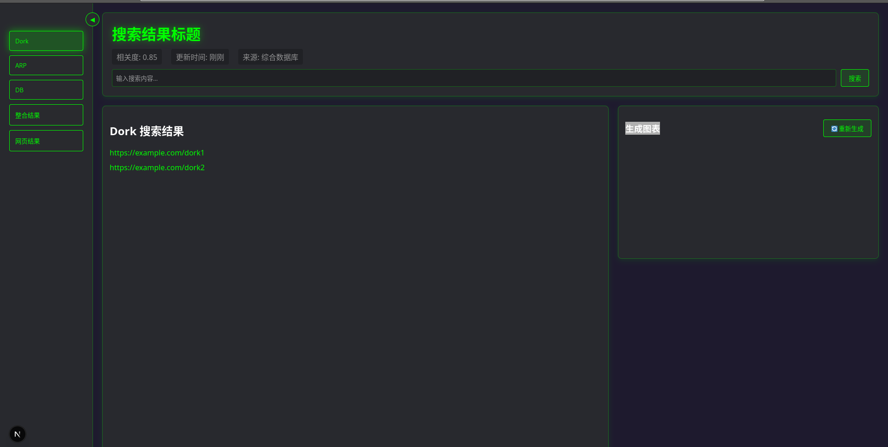

## **一、项目架构**

### 用户服务智能体框架


 

### 实时更新脚本工作流


# 二、环境配置

## 1. Elastisearch
## 2. mofa

```bash
git clone https://github.com/moxin-org/mofa.git
conda cerate -n py310 python=3.10.12 -y
cd mofa/python
pip install -r requirements.txt (if this command report error, never mind it
pip install -e .
python -V
python -c "import mofa" && echo "mofa install successfully"
```
## 3. moxin(coming...)

## 4. python env

## 5. cargo

## 6. dora
### 	Fedora

```bash
sudo dnf install cargo rustup dora-cli
cargo install dora-rs
pip install dora-cli

```

### 	Arch

```bash
sudo pacman -S  cargo rustup dora-cli
cargo install dora-rs
pip install dora-cli
```

## 7. FastAPI

## 8. Python modules


# 三、展示

## 搜索页


## 结果页



